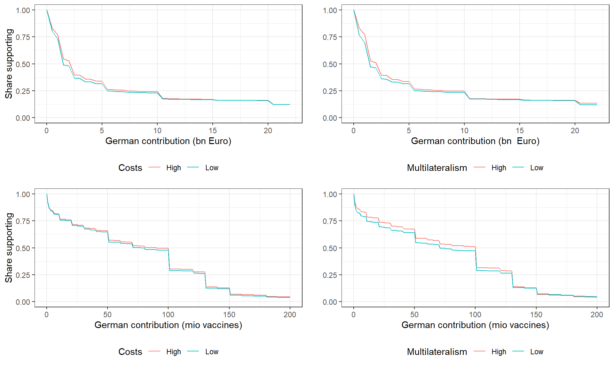
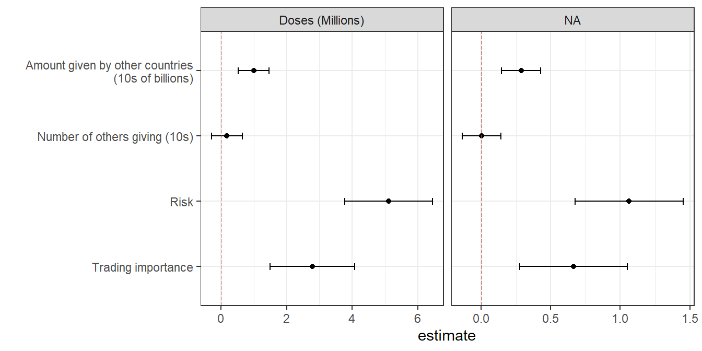
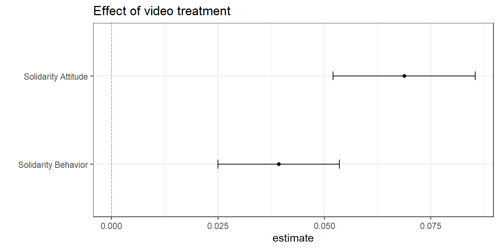
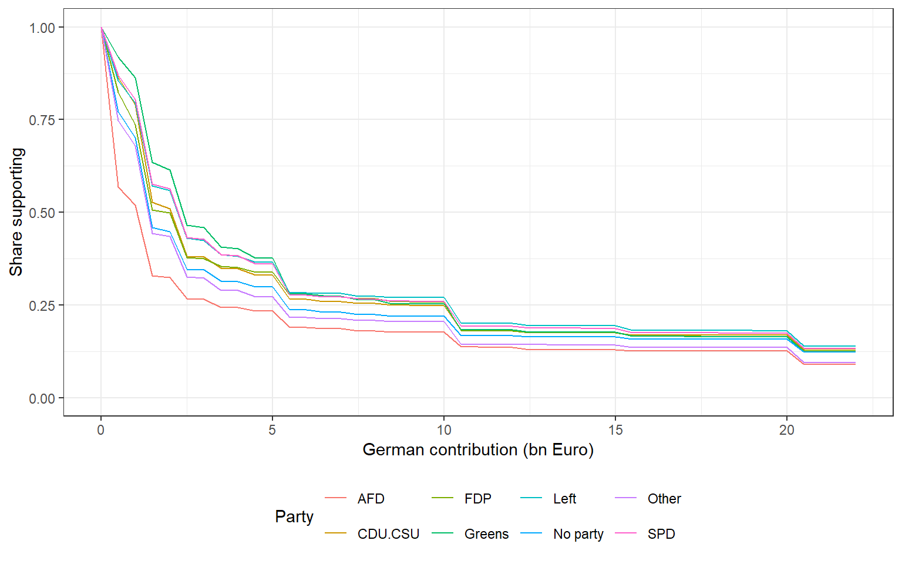
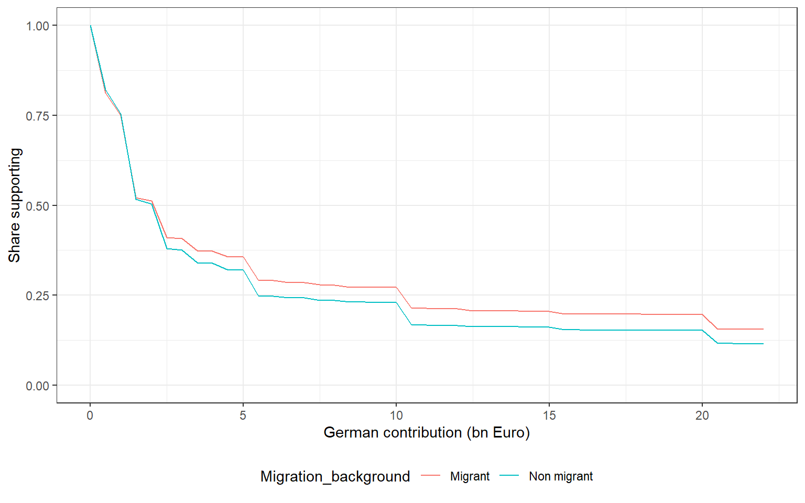
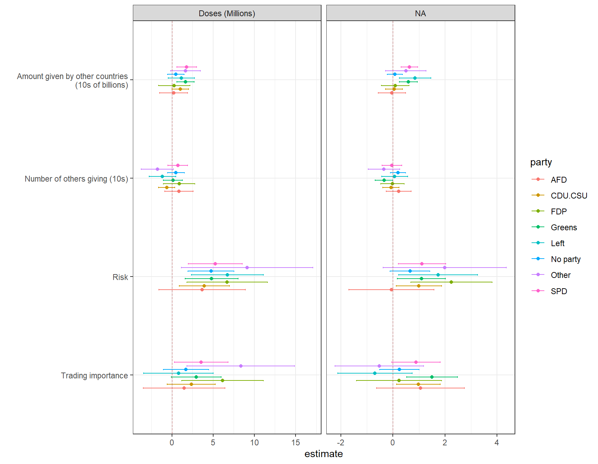
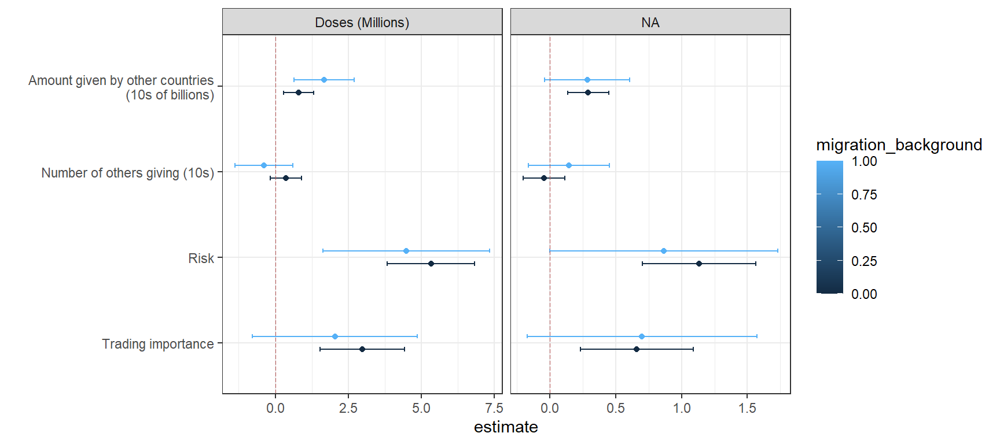
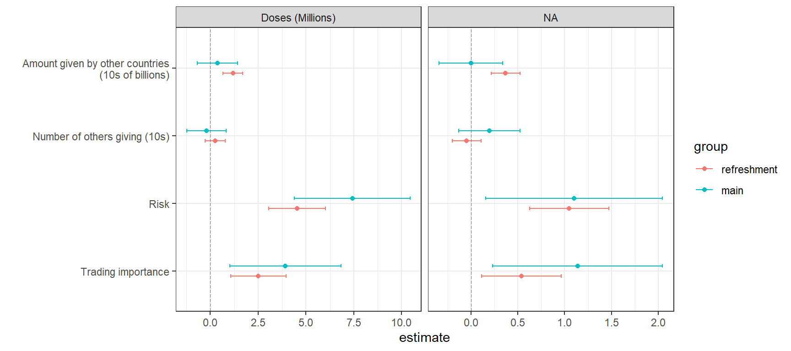

# Vaccine solidarity replication

This document reproduces the main tables and figures from “Vaccine
solidarity replication”. See
[`analysis.Rmd`](https://github.com/wzb-ipi/vaccine_solidarity/blob/main/analysis.Rmd)
for the original replication material.

The tables and figures are generated by using the functions that are
defined in the replication package. e.g. 

- `make_table_1(wave4_conjoint)`
- `make_figure_1(wave4_conjoint)`

But these also play nicely with functions in `replicate_everything` and
so one could also run:

- `run_replication("fig_1")`
- `run_replication("tab_1")`

The rest of the file runs these functions for each figure and table and
also displays the underlying code.

## Setup

``` r

library(rep1371journalpone0278337)
library(dplyr)
library(ggplot2)
library(egg)
library(estimatr)
library(bbmle)
library(broom)
library(modelsummary)
library(kableExtra)

ns <- asNamespace("rep1371journalpone0278337")
clean_replication_source <- ns$clean_replication_source
show_make_source <- ns$show_make_source
```

## Data

Data is drawn from the package

``` r

data(wave4_conjoint, package = "rep1371journalpone0278337")
data(wave2_survey, package = "rep1371journalpone0278337")
data(vignette_labels, package = "rep1371journalpone0278337")
```

The source repository rebuilds `df_4` and `df_2` from raw CSV exports.
This package ships prepared **`wave4_conjoint`**, **`wave2_survey`**,
and **`vignette_labels`**. Rebuild from raw data with
[`prep_data()`](https://replicate-anything.github.io/rep-10.1371-journal.pone.0278337/reference/prep_data.md)
when needed.

    $wave4_rows
    [1] 21050

    $wave2_rows
    [1] 13782

## Analysis: main results

### Figure 1: Distribution of support for contributions of different sizes

Implementation: `R/make_figure_1.R`

``` r

wave4_conjoint |>
  make_figure_1() |>
  format_figure_1()
```



Figure 1: Figure 1. Distribution of support for contributions of
different sizes.

Show underlying code

`R/make_figure_1.R`

``` r

make_figure_1 <- function(data = wave4_conjoint) {
  grids <- amount_grids()

  s1 <- dplyr::bind_rows(
    Low = support_curve(
      data[data$risk_factor == "Low" & data$trading_factor == "Low", "cash_billions", drop = TRUE],
      grids$cash
    ),
    High = support_curve(
      data[data$risk_factor == "High" & data$trading_factor == "High", "cash_billions", drop = TRUE],
      grids$cash
    ),
    .id = "Costs"
  )

  s2 <- dplyr::bind_rows(
    Low = support_curve(
      data[data$deal == "No deal", "cash_billions", drop = TRUE],
      grids$cash
    ),
    High = support_curve(
      data[data$deal == "40 give 40 bn", "cash_billions", drop = TRUE],
      grids$cash
    ),
    .id = "Multilateralism"
  )

  s3 <- dplyr::bind_rows(
    Low = support_curve(
      data[data$risk_factor == "Low" & data$trading_factor == "Low", "doses", drop = TRUE],
      grids$vaccines
    ),
    High = support_curve(
      data[data$risk_factor == "Low" & data$trading_factor == "High", "doses", drop = TRUE],
      grids$vaccines
    ),
    .id = "Costs"
  )

  s4 <- dplyr::bind_rows(
    Low = support_curve(
      data[data$deal == "No deal", "doses", drop = TRUE],
      grids$vaccines
    ),
    High = support_curve(
      data[data$deal == "40 give 40 bn", "doses", drop = TRUE],
      grids$vaccines
    ),
    .id = "Multilateralism"
  )

  egg::ggarrange(
    ggplot2::ggplot(s1, ggplot2::aes(.data$amounts, .data$support, color = .data$Costs)) +
      ggplot2::geom_line() + ggplot2::ylim(0, 1) + ggplot2::theme_bw() +
      ggplot2::xlab("German contribution (bn Euro)") + ggplot2::ylab("Share supporting") +
      ggplot2::theme(legend.position = "bottom"),
    ggplot2::ggplot(s2, ggplot2::aes(.data$amounts, .data$support, color = .data$Multilateralism)) +
      ggplot2::geom_line() + ggplot2::ylim(0, 1) + ggplot2::theme_bw() +
      ggplot2::xlab("German contribution (bn  Euro)") + ggplot2::ylab("Share supporting") +
      ggplot2::theme(legend.position = "bottom") + ggplot2::ylab(""),
    ggplot2::ggplot(s3, ggplot2::aes(.data$amounts, .data$support, color = .data$Costs)) +
      ggplot2::geom_line() + ggplot2::ylim(0, 1) + ggplot2::theme_bw() +
      ggplot2::xlab("German contribution (mio vaccines)") + ggplot2::ylab("Share supporting") +
      ggplot2::theme(legend.position = "bottom"),
    ggplot2::ggplot(s4, ggplot2::aes(.data$amounts, .data$support, color = .data$Multilateralism)) +
      ggplot2::geom_line() + ggplot2::ylim(0, 1) + ggplot2::theme_bw() +
      ggplot2::xlab("German contribution (mio vaccines)") + ggplot2::ylab("Share supporting") +
      ggplot2::theme(legend.position = "bottom") + ggplot2::ylab(""),
    nrow = 2,
    ncol = 2
  )
}
```

### Figure 2: Marginal effects of conditions

Implementation: `R/make_figure_2.R`

The average proposal is **8.67** billion Euros and **78** million doses.
The median proposal is **2** billion Euros and **90** million doses.

``` r

wave4_conjoint |>
  make_figure_2() |>
  format_figure_2()
```



Figure 2: Figure 2. Marginal effects of conditions.

Show underlying code

`R/make_figure_2.R`

``` r

make_figure_2 <- function(data = wave4_conjoint) {
  plot_marginal_effects(fit_marginal_effects(data))
}
```

### Figure 3: Effect of video treatment on individual solidarity

Implementation: `R/make_figure_3.R`

``` r

wave2_survey |>
  make_figure_3() |>
  format_figure_3()
```



Figure 3: Figure 3. Effect of video treatment on individual solidarity.

Show underlying code

`R/make_figure_3.R`

``` r

make_figure_3 <- function(data = wave2_survey) {
  outcomes <- c("solidarity_behaviour", "solidarity_attitude")
  outcome_labels <- c("Solidarity Behavior", "Solidarity Attitude")

  models_basic <- stats::setNames(
    lapply(outcomes, function(y) {
      estimatr::lm_robust(
        stats::as.formula(paste(y, "~ treatment_video")),
        data = data
      )
    }),
    outcomes
  )

  dplyr::bind_rows(lapply(models_basic, broom::tidy), .id = "outcome") |>
    dplyr::filter(.data$term != "(Intercept)") |>
    dplyr::mutate(outcome = factor(.data$outcome, outcomes, outcome_labels)) |>
    ggplot2::ggplot(ggplot2::aes(.data$estimate, .data$outcome)) +
    ggplot2::geom_point() +
    ggplot2::geom_errorbar(
      ggplot2::aes(xmin = .data$conf.low, xmax = .data$conf.high),
      width = 0.1
    ) +
    ggplot2::geom_vline(
      xintercept = 0,
      linetype = "longdash",
      lwd = 0.35,
      colour = "#B55555"
    ) +
    ggplot2::theme_bw() +
    ggplot2::ggtitle("Effect of video treatment") +
    ggplot2::ylab("")
}
```

## Additional Results

### Figure 4: Levels of support by party

Implementation: `R/make_figure_4.R`

``` r

wave4_conjoint |>
  make_figure_4() |>
  format_figure_4()
```



Figure 4: Figure 4. Levels of support by party.

Show underlying code

`R/make_figure_4.R`

``` r

make_figure_4 <- function(data = wave4_conjoint) {
  grids <- amount_grids()
  sp <- lapply(unique(data$party), function(p) {
    support_curve(
      data[data$party == p, "cash_billions", drop = TRUE],
      grids$cash
    )
  })
  names(sp) <- unique(data$party)
  sp <- dplyr::bind_rows(sp, .id = "Party")

  ggplot2::ggplot(sp, ggplot2::aes(.data$amounts, .data$support, color = .data$Party)) +
    ggplot2::geom_line() +
    ggplot2::ylim(0, 1) +
    ggplot2::theme_bw() +
    ggplot2::xlab("German contribution (bn Euro)") +
    ggplot2::ylab("Share supporting") +
    ggplot2::theme(legend.position = "bottom")
}
```

### Figure 5: Levels of support by migration background

Implementation: `R/make_figure_5.R`

``` r

wave4_conjoint |>
  make_figure_5() |>
  format_figure_5()
```



Figure 5: Figure 5. Levels of support by migration background.

Show underlying code

`R/make_figure_5.R`

``` r

make_figure_5 <- function(data = wave4_conjoint) {
  grids <- amount_grids()
  sm <- lapply(0:1, function(m) {
    support_curve(
      data[data$migration_background == m, "cash_billions", drop = TRUE],
      grids$cash
    )
  })
  names(sm) <- c("Non migrant", "Migrant")
  sm <- dplyr::bind_rows(sm, .id = "Migration_background")

  ggplot2::ggplot(
    sm,
    ggplot2::aes(.data$amounts, .data$support, color = .data$Migration_background)
  ) +
    ggplot2::geom_line() +
    ggplot2::ylim(0, 1) +
    ggplot2::theme_bw() +
    ggplot2::xlab("German contribution (bn Euro)") +
    ggplot2::ylab("Share supporting") +
    ggplot2::theme(legend.position = "bottom")
}
```

### Figure 6: Marginal effects of conditions by party

Implementation: `R/make_figure_6.R`

``` r

wave4_conjoint |>
  make_figure_6() |>
  format_figure_6()
```



Figure 6: Figure 6. Marginal effects of conditions by party.

Show underlying code

`R/make_figure_6.R`

``` r

make_figure_6 <- function(data = wave4_conjoint) {
  plot_marginal_effects(
    fit_marginal_effects_by(data, "party"),
    group_var = "party",
    flip_axes = TRUE
  )
}
```

### Figure 7: Marginal effects of conditions by migration background

Implementation: `R/make_figure_7.R`

``` r

wave4_conjoint |>
  make_figure_7() |>
  format_figure_7()
```



Figure 7: Figure 7. Marginal effects of conditions by migration
background.

Show underlying code

`R/make_figure_7.R`

``` r

make_figure_7 <- function(data = wave4_conjoint) {
  plot_marginal_effects(
    fit_marginal_effects_by(data, "migration_background"),
    group_var = "migration_background",
    flip_axes = TRUE
  )
}
```

### Figure 8: Results refreshment sample

Implementation: `R/make_figure_8.R`

``` r

wave4_conjoint |>
  make_figure_8() |>
  format_figure_8()
```



Figure 8: Figure 8. Results refreshment sample.

Show underlying code

`R/make_figure_8.R`

``` r

make_figure_8 <- function(data = wave4_conjoint) {
  results <- fit_marginal_effects_by(data, "group")
  results$group <- factor(
    results$group,
    levels = c(4, 5),
    labels = c("refreshment", "main")
  )
  plot_marginal_effects(
    results,
    group_var = "group",
    flip_axes = TRUE
  )
}
```

### Table 1: Structural analysis

Implementation: `R/make_table_1.R`

We assume

``` math
u = (a + bT + cR) \log(Y + x) - x^2 - g(x - ky)^2
```

where $`T`$ is trading importance, $`R`$ is health risk, $`Y`$ is total
amount given by other countries, and $`y`$ is average amount given by
other countries.

``` r

wave4_conjoint |>
  make_table_1() |>
  format_table_1() |>
  knitr::asis_output()
```

| parameter | estimate | std.error | statistic | p.value | conf.low | conf.high |
|:----------|---------:|----------:|----------:|--------:|---------:|----------:|
| α         |   240.62 |      2.01 |    119.73 |    0.00 |   236.68 |    244.56 |
| β         |   -10.32 |     12.71 |     -0.81 |    0.42 |   -35.23 |     14.59 |
| δ         |    37.79 |     12.45 |      3.04 |    0.00 |    13.40 |     62.19 |
| γ         |     0.61 |      0.07 |      9.22 |    0.00 |     0.48 |      0.75 |
| κ         |     5.22 |      0.40 |     13.06 |    0.00 |     4.44 |      6.00 |
| σ         |    15.98 |      0.08 |    205.18 |    0.00 |    15.83 |     16.14 |

Show underlying code

`R/make_table_1.R`

``` r

make_table_1 <- function(data = wave4_conjoint) {
  df_4 <- dplyr::mutate(data, x = .data$cash_billions)

  LL <- function(a = 1, b = 1, c = 1, g = 1, k = 1, sigma = 1) {
    R <- mapply(
      structural_lik_x,
      df_4$x,
      MoreArgs = list(
        sigma = sigma,
        a = a,
        b = b,
        c = c,
        g = g,
        k = k,
        ZT = df_4$trading_importance,
        ZR = df_4$risk,
        ZY = df_4$others_giving,
        Zy = df_4$others_average
      )
    )
    -sum(log(R))
  }

  fit <- bbmle::mle2(
    LL,
    optimizer = "nlminb",
    start = list(a = 240, b = -11, c = 41, g = 0.8, k = 4, sigma = 16),
    lower = list(a = 0, b = -20, c = -60, g = 0.01, k = -10, sigma = 0.02),
    upper = list(a = 400, b = 20, c = 60, g = 5, k = 10, sigma = 30)
  )

  out <- as.data.frame(bbmle::coef(bbmle::summary(fit)))
  names(out) <- c("estimate", "std.error", "statistic", "p.value")

  out |>
    dplyr::mutate(parameter = c("\u03b1", "\u03b2", "\u03b4", "\u03b3", "\u03ba", "\u03c3")) |>
    dplyr::relocate(.data$parameter) |>
    dplyr::mutate(
      conf.low = .data$estimate - 1.96 * .data$std.error,
      conf.high = .data$estimate + 1.96 * .data$std.error
    ) |>
    dplyr::mutate(dplyr::across(where(is.numeric), ~ round(.x, 2)))
}
```

### Table 2: Wave 2 conjoint (additional analyses)

Implementation: `R/make_table_2.R`

``` r

make_table_2(wave2_survey, vignette_labels) |>
  format_table_2() |>
  knitr::asis_output()
```

|                                            |    rating    |    choice    |
|:-------------------------------------------|:------------:|:------------:|
| Constant (Average rating)                  | 0.172\*\*\*  | 0.529\*\*\*  |
|                                            |   (0.028)    |   (0.007)    |
| Video effect (given ungenerous agreement)  | −0.190\*\*\* | −0.044\*\*\* |
|                                            |   (0.041)    |   (0.010)    |
| German contribution                        | −0.101\*\*\* | −0.030\*\*\* |
|                                            |   (0.009)    |   (0.002)    |
| German share                               | −0.097\*\*\* | −0.022\*\*\* |
|                                            |   (0.009)    |   (0.002)    |
| Number of donors                           | 0.165\*\*\*  | 0.058\*\*\*  |
|                                            |   (0.012)    |   (0.003)    |
| Economic benefits                          | −0.209\*\*\* | −0.053\*\*\* |
|                                            |   (0.020)    |   (0.005)    |
| Health benefits                            | 0.133\*\*\*  | 0.036\*\*\*  |
|                                            |   (0.020)    |   (0.005)    |
| Video \* Contribution                      | 0.060\*\*\*  | 0.020\*\*\*  |
|                                            |   (0.013)    |   (0.003)    |
| Video \* Share                             |    0.020     |    0.002     |
|                                            |   (0.013)    |   (0.003)    |
| Video \* Donors                            | 0.095\*\*\*  | 0.019\*\*\*  |
|                                            |   (0.017)    |   (0.004)    |
| Video \* Economics                         |    −0.011    |    −0.008    |
|                                            |   (0.028)    |   (0.007)    |
| Video \* Health                            |    −0.048    |   −0.014\*   |
|                                            |   (0.028)    |   (0.007)    |
| R2                                         |    0.015     |    0.021     |
| R2 Adj.                                    |    0.015     |    0.021     |
| Num.Obs.                                   |    82692     |    82692     |
| RMSE                                       |     2.03     |     0.49     |
|  \*\*\* p\<0.001; \*\* p\<0.01; \* p\<0.05 |              |              |

Effects of treatment on drivers of support for agreements. {.table
.table .caption-top
style="NAborder-bottom: 0; width: auto !important; margin-left: auto; margin-right: auto;"}

Show underlying code

`R/make_table_2.R`

``` r

make_table_2 <- function(survey = wave2_survey, labels = vignette_labels) {
  conjoints_norm <- prep_data_tab_2(survey, labels)

  models_treatments <- list(
    rating = estimatr::lm_robust(
      rating ~ treatment_video * vig_doses + treatment_video * vig_dose_share +
        treatment_video * vig_countries + treatment_video * vig_benefit_economic +
        treatment_video * vig_benefit_health,
      data = conjoints_norm
    ),
    choice = estimatr::lm_robust(
      outcome ~ treatment_video * vig_doses + treatment_video * vig_dose_share +
        treatment_video * vig_countries + treatment_video * vig_benefit_economic +
        treatment_video * vig_benefit_health,
      data = conjoints_norm
    )
  )

  coef_map <- c(
    "(Intercept)" = "Constant (Average rating)",
    "treatment_video" = "Video effect (given ungenerous agreement)",
    "vig_doses" = "German contribution",
    "vig_dose_share" = "German share",
    "vig_countries" = "Number of donors",
    "vig_benefit_economic" = "Economic benefits",
    "vig_benefit_health" = "Health benefits",
    "treatment_video:vig_doses" = "Video * Contribution",
    "treatment_video:vig_dose_share" = "Video * Share",
    "treatment_video:vig_countries" = "Video * Donors",
    "treatment_video:vig_benefit_economic" = "Video * Economics",
    "treatment_video:vig_benefit_health" = "Video * Health"
  )

  modelsummary::modelsummary(
    models_treatments,
    coef_map = coef_map,
    estimate = "{estimate}{stars}",
    statistic = "({std.error})",
    output = "kableExtra",
    stars = c("***" = 0.001, "**" = 0.01, "*" = 0.05),
    gof_map = c("r.squared", "adj.r.squared", "nobs", "rmse"),
    title = "Effects of treatment on drivers of support for agreements.",
    notes = "*** p<0.001; ** p<0.01; * p<0.05",
    colnames = c("rating", "choice")
  )
}
```

## Session info

``` r

sessionInfo()
```

    R version 4.6.0 (2026-04-24 ucrt)
    Platform: x86_64-w64-mingw32/x64
    Running under: Windows 11 x64 (build 26200)

    Matrix products: default
      LAPACK version 3.12.1

    locale:
    [1] LC_COLLATE=English_United States.utf8
    [2] LC_CTYPE=English_United States.utf8
    [3] LC_MONETARY=English_United States.utf8
    [4] LC_NUMERIC=C
    [5] LC_TIME=English_United States.utf8

    time zone: Europe/Berlin
    tzcode source: internal

    attached base packages:
    [1] stats4    stats     graphics  grDevices utils     datasets  methods
    [8] base

    other attached packages:
     [1] kableExtra_1.4.0                modelsummary_2.6.0
     [3] broom_1.0.13                    bbmle_1.0.25.1
     [5] estimatr_1.0.6                  egg_0.4.5
     [7] gridExtra_2.3                   ggplot2_4.0.3
     [9] dplyr_1.2.1                     rep1371journalpone0278337_0.1.0

    loaded via a namespace (and not attached):
     [1] generics_0.1.4      tidyr_1.3.2         xml2_1.5.2
     [4] stringi_1.8.7       lattice_0.22-9      digest_0.6.39
     [7] magrittr_2.0.5      evaluate_1.0.5      grid_4.6.0
    [10] RColorBrewer_1.1-3  mvtnorm_1.4-1       fastmap_1.2.0
    [13] jsonlite_2.0.0      Matrix_1.7-5        backports_1.5.1
    [16] Formula_1.2-5       httr_1.4.8          purrr_1.2.2
    [19] viridisLite_0.4.3   scales_1.4.0        codetools_0.2-20
    [22] textshaping_1.0.5   numDeriv_2016.8-1.1 cli_3.6.6
    [25] rlang_1.2.0         texreg_1.39.5       withr_3.0.2
    [28] yaml_2.3.12         otel_0.2.0          tools_4.6.0
    [31] bdsmatrix_1.3-7     vctrs_0.7.3         R6_2.6.1
    [34] lifecycle_1.0.5     stringr_1.6.0       htmlwidgets_1.6.4
    [37] MASS_7.3-65         pkgconfig_2.0.3     pillar_1.11.1
    [40] gtable_0.3.6        data.table_1.18.4   glue_1.8.1
    [43] Rcpp_1.1.1-1.1      systemfonts_1.3.2   xfun_0.58
    [46] tibble_3.3.1        tidyselect_1.2.1    rstudioapi_0.19.0
    [49] knitr_1.51          farver_2.1.2        tables_0.9.35
    [52] htmltools_0.5.9     svglite_2.2.2       rmarkdown_2.31
    [55] compiler_4.6.0      S7_0.2.2           
